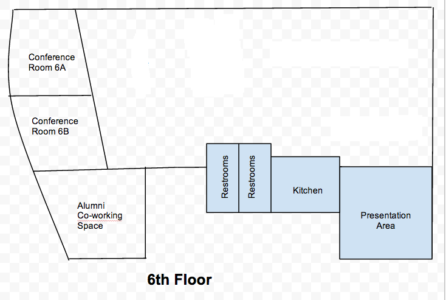

## Welcome to #neoHack14

## Schedule Day 1

| When  | What                                                                            | Where     |
|-------|---------------------------------------------------------------------------------|-----------|
| 5:30  | Registration Opens                                                              | 7th floor |
| 6:00  | Dinner + Mingling                                                               | 7th floor |
| 7:00  | Welcome - Logistics - Sponsor intros - How to kill it at your first hackathon   | 7th floor |
| 7:25  | API talks - Adobe PhoneGap - Firebase API - Macy's API                          | 7th floor |
| 8:10  | Networking Bingo                                                                | 7th floor |
| 8:25  | Data/Tools - D3 - Health Data (10m)  - Adobe Bracket                            | 7th floor |
| 9:00  | 60-second idea pitches                                                          | 7th floor |
| 10:00 | Go home and dream of code                                                       |           |

##Schedule Day 2
| When    | What                                                                                                                                                                                                                                                                     | Where     |
|---------|--------------------------------------------------------------------------------------------------------------------------------------------------------------------------------------------------------------------------------------------------------------------------|-----------|
| 8:00am  | Doors open, breakfast is served                                                                                                                                                                                                                                          | 7th floor |
| 9:00am  | Design sprint process                                                                                                                                                                                                                                                    | 7th floor |
| 9:20am  | Mentor guides team through storyboarding and paper prototyping                                                                                                                                                                                                           | 7th floor |
| 10:00am | 30min breakout Sessions:           | various                      |
|         | D3 with Aysegul Yonet              | 8th floor, bender            |
|         | Adobe PhoneGap with Julee Burdekin | 6th floor, presentation area |
|         | Firebase API with Jenny Tong       | 8th floor, presentation area |
|         | Macy's API with Damian Bennett     | 7th floor, presentation area |
| 11:00am | Hacking continues, API helpdesk available all day                                                                                                                                                                                                                        |           |
| 12:00pm | Lunch available (working lunch)                                                                                                                                                                                                                                          | 7th floor |
| 12:30pm | Lightning Talk: How to pitch                                                                                                                                                                                                                                             | 7th floor |
| 1:00pm  | Pitch rehearsals                                                                                                                                                                                                                                                         |  7th floor         |
| 5:00pm  | Presentations                                                                                                                                                                                                                                                            | 7th floor          |
| 6:45pm  | Judges convene and select winners                                                                                                                                                                                                                                        |  7th floor         |
| 7:00pm  | Winners announced                                                                                                                                                                                                                                                        |   7th floor        |
| 8:30pm  | Go home, eat, and enjoy the evening! Self-organize drinks if you’re interested!                                                                                                                                                                                          |           |
##Map

### 6th floor

### 7th floor

### 8th floor

